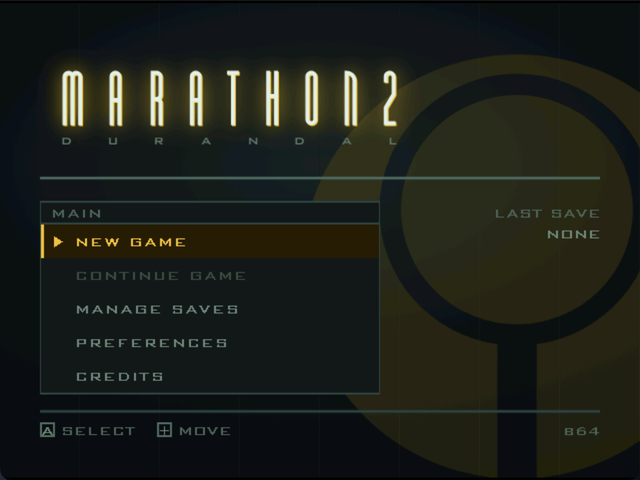

# Marathon 2 on the Sega Dreamcast

Bungie's *Marathon 2: Durandal* running on real Dreamcast hardware, built with a
current KallistiOS toolchain, with saved games on a VMU and an interface built
for a controller instead of a mouse.

It boots from a burned disc or a GDEMU, plays the full retail campaign, keeps
preferences and saved games on a memory card, shows the framerate and the
player's health and air on the VMU screen, and is driven entirely by a Dreamcast
pad. Roughly 15–20 fps on a console, for now.

## Where this came from

BERO ported Aleph One 0.12.0 to the Dreamcast in 2002, against KallistiOS 1.1.7
and a toolchain of the same age. That port is the starting point here, applied to
a clean Aleph One 0.12.0 tarball.

Very little of the 2002 Dreamcast glue survives. KOS 1.1.7's filesystem calls,
its maple bus API and its threading are all gone from modern KOS, and BERO's
`fs_mem.c` and `syscalls.c` were written against them. gcc went from 3.x to 15.2,
which rejects a great deal of 2002 C++ outright.

## What was changed

**Saved games fit on a memory card.** A Marathon 2 save is 214,629 bytes. A VMU
holds 200 usable blocks, about 102,400 bytes. The first attempt refused the write
and said so: *card full, need 421 blocks, 194 free.* But 94% of a save is a
verbatim copy of map data already pressed on the disc, so before compressing,
`dc/dc_wad.c` XORs the save chunk by chunk against the same chunk of the same
level read back off the CD. Unchanged bytes become zero and deflate swallows runs
of zeroes. 163 blocks down to 23. XOR rather than a cleverer diff because it is
its own inverse: restore runs the identical call and needs to understand nothing
about the data.

**Four save slots with real metadata.** The stock save dialog asks for a typed
filename, which is why every save this port made before b59 was called "Untitled
Game." There are four slots now, named automatically, each showing the level, the
elapsed time and what it costs on the card, read from a versioned 128-byte header
so listing four saves costs four small reads instead of four decompressions.

**The interface was rebuilt for a controller.** The stock main menu is two full-screen
images with the buttons painted into the artwork and eighteen hardcoded hit
rectangles; changing an item meant opening a paint program. It is now a static
plate with text drawn over it, so the item list is an array. Preferences, the
save screens, difficulty, the pause menu and a button-binding screen were built
to match a working HTML prototype in `mockups/prototype/`.

**The controller can reach everything.** Aleph One's in-game commands are Alt+key chords
that a pad cannot produce, so there was no way to pause, no way to save away from
a terminal, and no way off a level short of resetting the console. Start opens a
pause menu. Every action can be bound to any button.

**A hardware renderer that works, and does not ship.** Aleph One's OpenGL path
runs on the PowerVR through GLdc. It's a glitchy mess and I'm focusing on quality of life and other improvements before tackling it again.

**Load times.** A level took one to two minutes. Timing it showed where: the
chapter screen was 22.5 seconds, monster sounds 13.7, collections 7.7.
The chapter screen is skipped and "More Sounds" is surfaced as a setting that
says what it costs.

## Build

Needs a KallistiOS toolchain at `/opt/toolchains/dc` and the four retail data
files, neither of which is in this repository. [README.DC.md](README.DC.md) has
both.

    ./build.sh            # the ELF
    ./build.sh test       # small unpadded .cdi, for Flycast
    ./build.sh cdi        # padded .cdi, for burning or a GDEMU

Padding is not optional. An unpadded image boots in an emulator and does not boot
on a console.

## Documentation

| | |
|---|---|
| [README.DC.md](README.DC.md) | how the port works, in detail |
| [BUGS.md](BUGS.md) | faults found, including the ones that only appear on hardware |
| [BACKLOG.md](BACKLOG.md) | wanted, and done |
| [BUILDS.md](BUILDS.md) | every numbered build and what was in it |
| [MENU-TREE.md](MENU-TREE.md) | every screen and setting, and what each is worth on a console |
| [UI-HANDOFF.md](UI-HANDOFF.md) | the interface design and the measurements behind it |
| [UI-BRIEF.md](UI-BRIEF.md) | the constraints a screen here has to respect |
| `mockups/prototype/` | that design, as a working prototype; open `index.html` |

Two constraints run through all of it. Nothing readable may sit within 40 pixels
of any edge, because a television eats it. And no one-pixel horizontal lines: the
output is 480i, so a single-pixel row lives on one field and buzzes at 30Hz.

## Built on

| | |
|---|---|
| [Aleph One](https://github.com/Aleph-One-Marathon/alephone) | the engine, from Bungie's 1999 Marathon 2 source release |
| [KallistiOS](https://github.com/KallistiOS/KallistiOS) | the Dreamcast SDK |
| [kos-ports](https://github.com/KallistiOS/kos-ports) | SDL, GL, zlib, libpng for it |
| [SDL 1.2](https://github.com/libsdl-org/SDL-1.2) | via kos-ports |
| [GLdc](https://gitlab.com/simulant/GLdc) | OpenGL on the PowerVR |
| [mkdcdisc](https://gitlab.com/simulant/mkdcdisc) | builds the disc images |
| [sh4zam](https://github.com/gyrovorbis/sh4zam) | SH4 store-queue routines, vendored under `dc/vendor` |
| [Flycast](https://github.com/flyinghead/flycast) | the emulator most of this was debugged in |

The VMU Profiler, also vendored under `dc/vendor`, is by
[Falco Girgis](https://github.com/gyrovorbis), as is sh4zam. Both are MIT; their
licences are beside the code.

BERO's 2002 Dreamcast port came from `sdl-dc.sourceforge.net`, which predates the
project being on GitHub.

## Licence

GPL, as Aleph One is. See [COPYING](COPYING), and [COPYING.SDL](COPYING.SDL) for
SDL. Marathon 2 is Bungie's; the engine work is the Aleph One contributors' and
Christian Bauer's; see [AUTHORS](AUTHORS).

Upstream's 2001 README and its BeOS, Unix and autotools build files are kept
under [`upstream/`](upstream/). They describe a different program on different
machines and are there for reference, not use.

**The retail data files are not in this repository and are not redistributable.**
